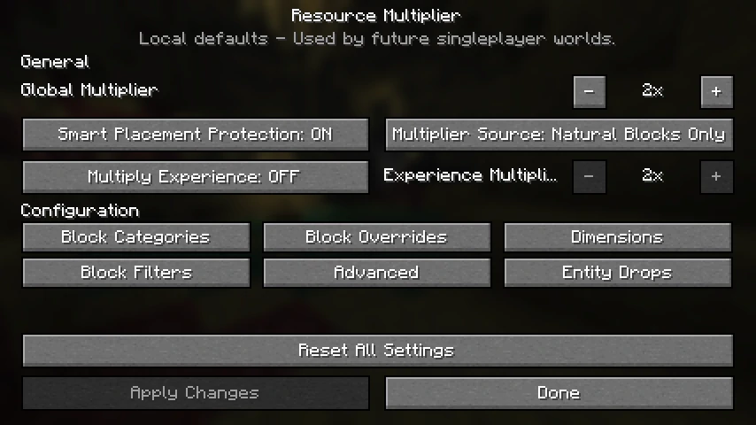
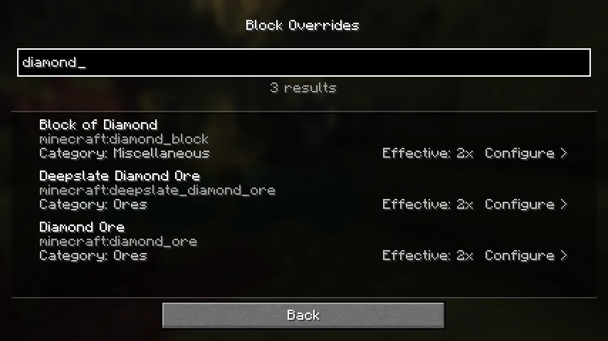
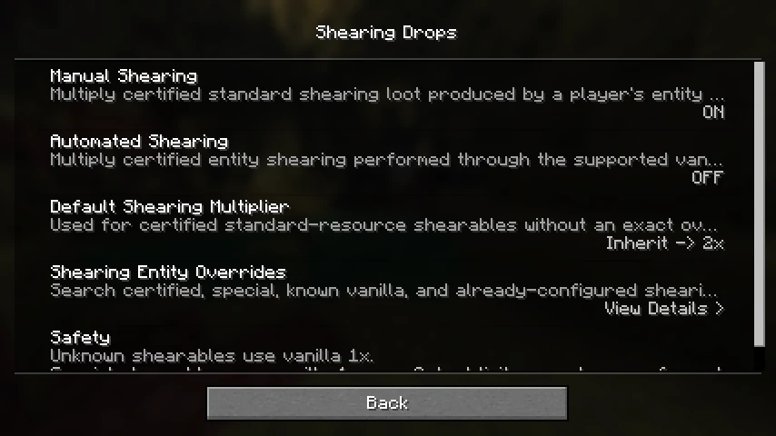

<p align="center">
  
</p>

<h1 align="center">Smart Resource Multiplier</h1>

<p align="center">
  Configurable multipliers for block drops, mob loot, and supported shearing,<br>
  with persistent anti-duplication protection.
</p>

<p align="center">
  <a href="https://github.com/chedidandrew/Resource-Multiplier/actions/workflows/build.yml"></a>
  
  
  <a href="https://www.curseforge.com/minecraft/mc-mods/resource-multiplier"></a>
  
  <a href="LICENSE"></a>
  
</p>

> [!IMPORTANT]
> **Newest release line:** Minecraft 26.2 remains the newest, default release on the `main` branch. This branch provides Smart Resource Multiplier `1.3.2` for Minecraft Java Edition 1.21.6 through 1.21.8.

> [!NOTE]
> Fabric and NeoForge store placed-block provenance in loader-specific formats. Configuration identity and schema remain compatible, but Minecraft world downgrades and cross-loader placed-block-data migration are not claimed for this backport. Back up a world before changing Minecraft versions or loaders.

Smart Resource Multiplier speeds up repetitive gathering by multiplying the final loot Minecraft already calculated. Fortune, Silk Touch, Looting, loot-table changes, item components, NBT, and legal stack sizes are preserved because the mod works after normal loot evaluation instead of replacing it.

Placed-block tracking and conservative safety rules prevent common duplication loops. The server owns gameplay settings in multiplayer, while clients can use the optional configuration interface and Mod Menu integration.

## Highlights

- Global, category, dimension, and individual block multipliers from `0x` through `64x`.
- Persistent anti-duplication protection for player-placed blocks, including piston movement and falling-block provenance.
- Optional, independent multiplication of standard non-player mob death loot.
- Optional manual and supported automated entity-shearing multiplication, with conservative handling for special rewards.
- Separate block, entity, shearing, category, dimension, source, and filter rules.
- Server-authoritative multiplication and configuration for multiplayer worlds.
- A native configuration GUI through `/smartdropsgui`, with optional Mod Menu integration.
- Read-only block/entity inspection and configuration validation commands for troubleshooting.
- Whole-result safety budgets that fall back to the original vanilla output instead of partially multiplying pathological loot.

Smart Resource Multiplier does not add vein mining, tree felling, automatic smelting, magnets, or inventory automation. Its project charter is deliberately limited to safely multiplying final loot at documented Minecraft boundaries.

## Screenshots

<p align="center">
  
</p>

<p align="center">
  
</p>

<p align="center">
  
</p>

These are real captures of the shared configuration interface used by both loaders. Current controls label block XP and mob XP separately.

## Download

Download the current release from [CurseForge](https://www.curseforge.com/minecraft/mc-mods/resource-multiplier). Source code and the dedicated 1.21.6-1.21.8 backport release are maintained on [GitHub](https://github.com/chedidandrew/Resource-Multiplier).

Choose exactly one matching file. Fabric uses `smart-resource-multiplier-1.3.2+mc1.21.6-1.21.8.jar` on all three versions. NeoForge uses `smart-resource-multiplier-neoforge-1.3.2+mc1.21.6.jar` on 1.21.6 and `smart-resource-multiplier-neoforge-1.3.2+mc1.21.7-1.21.8.jar` on 1.21.7-1.21.8. Remove older copies first and never install Fabric and NeoForge files together.

You can also [build the current source](#build-from-source). Do not download JARs from unofficial mirrors.

## Requirements and installation

| Component | Supported version |
| --- | --- |
| Minecraft Java Edition | 1.21.6, 1.21.7, or 1.21.8 |
| Mod loader | Fabric Loader 0.19.5+ or the matching NeoForge 21.6/21.7 line |
| Fabric API | Matching Fabric API for the installed Minecraft version |
| Java | 21 |
| Configuration-list integration | Mod Menu optional on Fabric; native Configure support on NeoForge |

1. Install Minecraft Java Edition 1.21.6, 1.21.7, or 1.21.8.
2. Install either Fabric Loader or NeoForge.
3. When using Fabric, install the matching Fabric API.
4. Place only the matching Fabric or NeoForge Smart Resource Multiplier JAR in the `mods` folder.
5. Install Smart Resource Multiplier on the server for authoritative multiplayer behavior.
6. Install it on the client when you want the configuration GUI or optional Mod Menu integration.

Starting once creates `config/smart_resource_drops.json`. The public rename did not change the internal mod ID (`smart_resource_drops`), configuration path, Java package, datapack namespace, saved-world provenance, network identifiers, or the legacy-compatible `/smartdrops` commands.

## Configuration at a glance

The default block behavior multiplies eligible natural resources by `2x`. Player-placed blocks remain vanilla `1x`, block entities are protected, automation and XP multiplication are opt-in, and unique or technical resources can remain on the safety blacklist.

Block rules resolve from most specific to broadest:

```text
Block override
> Category
> Dimension
> Global
```

Entity death-loot rules and shearing rules are separate domains with their own enablement, safety, and override paths. Changing one does not silently enable either of the others. Multiplayer edits are permission-checked and committed by the server; non-operators receive the same configuration screens in read-only mode.

Use `/smartdropsgui` to open the editor. Every child screen shares one staged draft, while **Apply Changes** on General performs the authoritative save. Complete field descriptions, defaults, presets, tag extension points, and migration behavior are in the [configuration reference](docs/CONFIGURATION.md).

## Common commands

```text
/smartdropsgui
/smartdrops status
/smartdrops inspect
/smartdrops inspect entity
/smartdrops validate
```

Inspection is read-only and uses the same rule-resolution logic as gameplay without breaking a block, damaging an entity, or generating loot. Validation is also read-only and checks configured IDs and tags against live registries without deleting unknown entries, but `/smartdrops validate` is restricted to game masters or the server console. Administrative changes require game-master permission.

See the [complete command reference](docs/COMMANDS.md) for verbose diagnostics, personal overrides, administrator controls, filters, presets, shearing settings, maintenance, and statistics.

## Safety and compatibility

- Natural blocks may be multiplied; player-placed blocks stay vanilla in the default source mode.
- Placement provenance survives supported piston and falling-block movement across saves.
- Block entities and inventory-bearing outputs are protected by default.
- Boss loot, equipment, inventories, and special transformations use conservative independent gates.
- Unsupported special shearing transformations stay at vanilla output; supported final item-list output follows the configured shearing rules.
- Output budgets prevent pathological item or stack explosions and return the complete original result on fallback.

Smart Resource Multiplier supports documented vanilla, Fabric, and NeoForge boundaries, not every mod automatically. Compatibility reports should name the loader plus the exact other project and version. See [Compatibility](docs/COMPATIBILITY.md), [Anti-duplication design](docs/ANTI_DUPE.md), [Edge cases](docs/EDGE_CASES.md), and [Performance](docs/PERFORMANCE.md) for the precise behavior and limitations.

## Build from source

Java 21 is required. The included Gradle wrapper verifies its pinned Gradle distribution. The root build produces the Fabric JAR in `build/libs/`; the NeoForge build produces its JAR in `neoforge/build/libs/`.

macOS or Linux:

```bash
./gradlew clean build
./gradlew -p neoforge clean build
```

Windows CMD:

```bat
gradlew.bat clean build
gradlew.bat -p neoforge clean build
```

The backport source builds the Fabric 1.21.6-1.21.8 JAR and the default NeoForge 1.21.7-1.21.8 JAR. The guarded release workflow also rebuilds the separate NeoForge 1.21.6 target with explicit Gradle properties before publishing exactly three loader/version-labelled files. Gradle automatically selects an installed Java 21 toolchain—or downloads one when absent. See [Testing and verification](docs/TESTING.md) for the full validator and GameTest sequence.

## Documentation

- [Configuration](docs/CONFIGURATION.md) — fields, defaults, hierarchy, presets, migrations, and GUI behavior.
- [Commands](docs/COMMANDS.md) — complete player, diagnostic, and administrator command reference.
- [Anti-duplication design](docs/ANTI_DUPE.md) — persistent provenance and transformation rules.
- [Compatibility](docs/COMPATIBILITY.md) — supported integration boundaries and datapack extension points.
- [Architecture](docs/ARCHITECTURE.md) — server-authoritative runtime design and loot boundaries.
- [Performance](docs/PERFORMANCE.md) — budgets, bounds, caches, and failure behavior.
- [Edge cases](docs/EDGE_CASES.md) — unusual block, entity, and interaction handling.
- [Testing](docs/TESTING.md) — automated evidence and manual test requirements.
- [Public release checklist](docs/PUBLIC_RELEASE_CHECKLIST.md) — automated, manual, and third-party release gates.
- [Build status](BUILD_STATUS.md) — current artifact identity and verification result.
- [Rebrand and upgrade compatibility](docs/REBRAND.md) — preserved identifiers, JAR-name transition, and upgrade steps.
- [Branding](docs/BRANDING.md) - current production icon identity, checksum, and release-history boundary.
- [GitHub publication guide](docs/GITHUB_UPLOAD.md) — contribution, CI, packaging, and release-latch process.
- [Security policy](SECURITY.md) and [Contributing](CONTRIBUTING.md) — reporting and development guidance.

## License and support

Smart Resource Multiplier is open source under the permissive [MIT License](LICENSE). You may use, copy, modify, publish, distribute, sublicense, or sell the software while retaining the copyright and permission notices.

Download releases from [CurseForge](https://www.curseforge.com/minecraft/mc-mods/resource-multiplier). Report ordinary defects through [GitHub Issues](https://github.com/chedidandrew/Resource-Multiplier/issues), use the compatibility form for a reproducible conflict with another mod, and follow [SECURITY.md](SECURITY.md) for sensitive reports. Source code and verified release checksums remain available on [GitHub](https://github.com/chedidandrew/Resource-Multiplier).

Development can be supported through [Ko-fi](https://ko-fi.com/andrewchedid), [PayPal](https://www.paypal.com/paypalme/chedidandrew), or [Cash App](https://cash.app/%24AndrewChedid). Support is optional and never changes access to releases, source code, issue support, or modpack permission.
